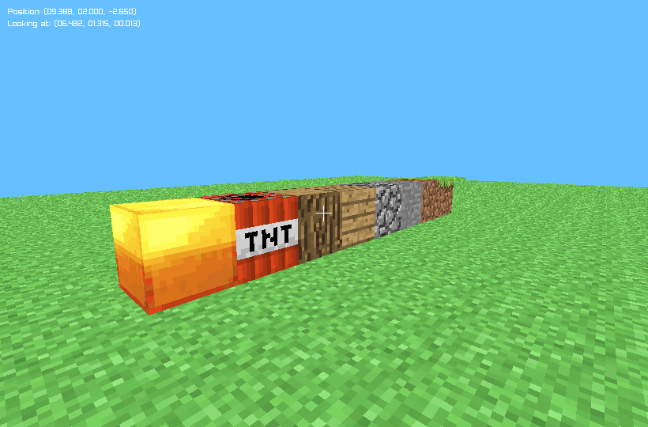

# cube tool

This cube/block "tool" is a 3D building/modeling tool.



## usage

```make run```

Use W,A,S,D to move, SPACE to toggle block size.

## dependencies

- raylib: Need to have raylib installed (I just haven't added a raylib subdirectory to this repo yet).
